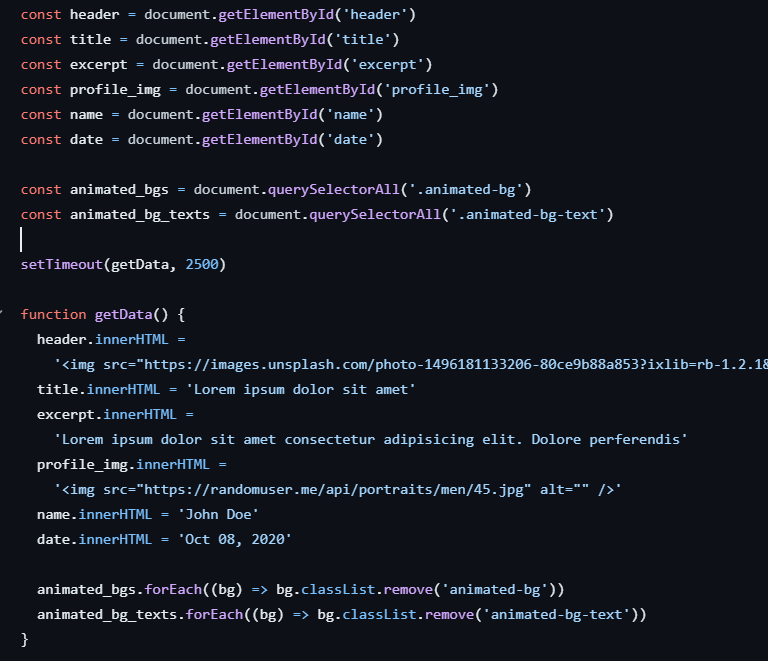
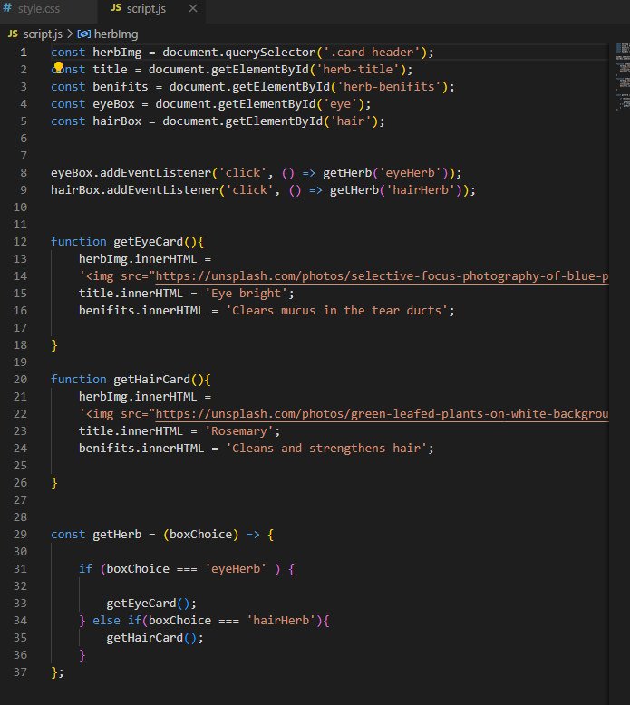

# Body Health App
## Body Health App Project Outline

### Project Description:
An App that categorizes herbs by their effect on different body-parts. You choose the desired body-part you would like to improve or heal and you get associated herbs that would help with that desired effect.

### Project Goals:
The overall goal of the project is to create an app that increase the knowlege to action side of an e-commerce business. To build a user focused, interactive app that improves the e-commerce experience for categorization of products.
 Categorizing the products by there uses and effects. Rather than a user scrolling through a normal e-commerce store where they would click on certain products and find out there uses and effects then click out of the product page and continue scrolling untill they find what they are looking for. I came up with a solution to give a quick product introductory, in the form of a image, small message of uses and a link to the product(which would then go to the product e-commerce page).

### purpose
To inform users of benefits of products,categorize those products and have seamless user experience.

### Target Audience:
E-commerce stores particularly health stores that are usually trying to solve problems for users. For example this can be used for a wide range of businesses, in this case, I choose a herb selling business that has the herbs categorized by their effect on different body-parts. You choose the desired body-part you would like to improve or heal and you get associated herbs that would help with that desired effect. I came across this probelem in health stores in particular where they would have a wide range of vitamins and supplements all that have a wide range of effects that cross over for there benificial properties. I always end up getting lost among the choices. So I decided to create a system that if you are looking to, clear your skin for example you can simply choose the skin body-part and you get associated herbs that improve your skin. Some of the herbs shown might have multiple benefits and therefore be associated with multiple body-parts. It is a user focused interactive e-commerce experience rather than the normal methods of categorizing products into product pages and repeating a lot of the same products accross multiple pages. In brick and mortar health stores this app would essentially be replaced with a knowledgable shop assistant that can talk to customers about what they are looking for and inform them of the possible choices of products they have on display. 


## Features
herbs for ailments feature allows you to select a body part say the 'eye' and returns herb cards which gives information on specific herbs that have a variety of different medicinal qualities for the eye or whicherver body part is selected within the frame. 

### Features Left to Implement
Once this would be implemented into an e-commerce site I would put in an add to basket button simply on the herb-card itself to allow for a seamless experience.

add collapsing images for the body-parts categorys. When you click the bodypart name it would expand and show the image in full, associated herb-cards, all other image boxes would currently only display collapsed image and title of category.This would also allow for more room in the viewport for smaller screen experiences and visual keep tract of which category (body-part) you are currently looking at rather than the option I choose which was highlighting the box and keep the structure of the box selection unchanged. 


## Testing 

### Bugs


#### Solved bugs


### Validator Testing


- **HTML**
  
- **CSS**
  
- **Accessibility**
  
## Deployment

This section should describe the process you went through to deploy the project to a hosting platform (e.g. GitHub) 

- The site was deployed to GitHub pages. The steps to deploy are as follows: 
  - in my GitHub repository,  I navigated to the Settings tab 
  - From the source section drop-down menu, I selected the Master Branch
  - Once the master branch has been selected, the page automatically refreshed with a detailed ribbon display to indicate the successful deployment. 

The live link can be found here - 


## Credits 
### Content 
[content placeholder- Brad traversy 50projects50days](https://github.com/bradtraversy/50projects50days/tree/master/content-placeholder)

I took inspiration from the "content placeholder" project from the 50projects in 50 days repository  by brad traversy (link above). The inspiration taken as outlined below and in the code comments for specific reference is clearly defined. Please see below the html structure for the content 'herb-cards' and one of the js code snippets described below. 

#### the html snip from the content placeholder project:
<body>
    <div class="card">
      <div class="card-header animated-bg" id="header">&nbsp;</div>

      <div class="card-content">
        <h3 class="card-title animated-bg animated-bg-text" id="title">
          &nbsp;
        </h3>
        <p class="card-excerpt" id="excerpt">
          &nbsp;
          <span class="animated-bg animated-bg-text">&nbsp;</span>
          <span class="animated-bg animated-bg-text">&nbsp;</span>
          <span class="animated-bg animated-bg-text">&nbsp;</span>
        </p>
        <div class="author">
          <div class="profile-img animated-bg" id="profile_img">&nbsp;</div>
          <div class="author-info">
            <strong class="animated-bg animated-bg-text" id="name"
              >&nbsp;</strong
            >
            <small class="animated-bg animated-bg-text" id="date">&nbsp;</small>
          </div>
        </div>
      </div>
    </div>

    <script src="script.js"></script>
  </body>

The inspiration I took :
  i used the  &nbsp; featured above to fill the h3 and p elements in my html code and use this method of then writing a js function to change the html tags content (seen below).

### excerpt from 'content placeholder' js file:


### Excerpt from my initial solution to show the appropriate herb cards on click:



the "Content-placeholder" which which was an inspiration for the JS code that would once the body parts would be selected would display them onto a Content-card. I took the code from the above and customized it to include 

### inspiration taken from the below project in script.js file :

[3d-boxes-background- Brad traversy 50projects50days](https://github.com/bradtraversy/50projects50days/tree/master/3d-boxes-background)


```javaScript
  function createBoxes() {
    for (let i = 0; i < 4; i++) {
      for (let j = 0; j < 4; j++) {
        const box = document.createElement('div')
        box.classList.add('box')
        box.style.backgroundPosition = `${-j * 125}px ${-i * 125}px`
        boxesContainer.appendChild(box)
      }
    }
  }
  createBoxes()

```

#### my code snippet used in my final version to create new herbcards if there are more herbs than cards on display 

```javaScript
// If there are not enough herb-card elements, create new ones
    if (herbCards.length < herbs.length) {
        for (let i = herbCards.length; i < herbs.length; i++)  {
            const newCard = document.createElement('div');
            newCard.classList.add('herb-card');`
```
i used the above for loop logic and the document.createElement method 


[Expanding Cards- Brad traversy 50projects50days](https://github.com/bradtraversy/50projects50days/blob/master/expanding-cards/script.js)

is used the following js code from the above git hub account. I used the code to add the 'active' css class to the selected body part box element in my project so once the body part is selected it would highlight the box and give refference for users from which body part they clicked and the herbs associated with it. 

```javaScript
const panels = document.querySelectorAll('.panel')

panels.forEach(panel => {
    panel.addEventListener('click', () => {
        removeActiveClasses()
        panel.classList.add('active')
    })
})

function removeActiveClasses() {
    panels.forEach(panel => {
        panel.classList.remove('active')
    })
}

```
#### My code for reference is as follows: 

```javaScript
/another event listener for box elements to highlight once selected
const boxes = document.querySelectorAll('.box');

boxes.forEach(box => {
    box.addEventListener('click', () =>{
        removeActiveClasses();
        box.classList.add('active');
    });
})

function removeActiveClasses() {
    boxes.forEach(box => {
        box.classList.remove('active');
    });
};
```

### Media
